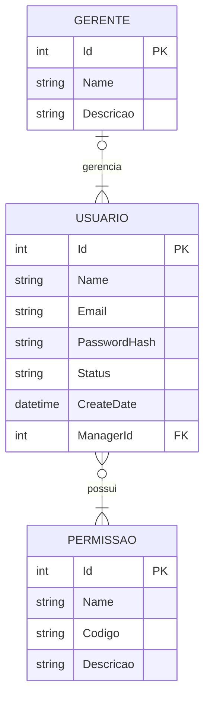

%

# Domínio Identity

## Objetivo

Responsável por autenticação, autorização e controle de acesso dos usuários do sistema.

## Entidades principais

- AppUser
- Perfil
- Permissao

## Diagrama ER

%

